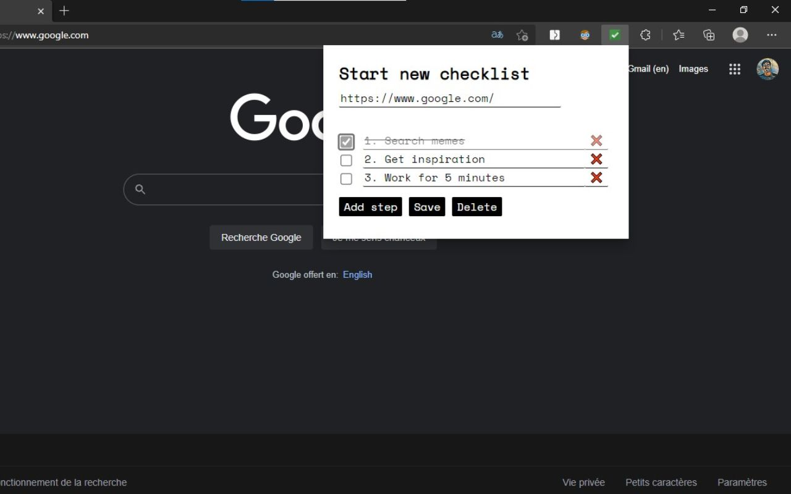

# Checklist Universe
I made this extension after seeing Atul Gawande's [TED talk](https://www.ted.com/talks/atul_gawande_how_do_we_heal_medicine/transcript?language=en) on the power of checklists. 
He showed how even professional neurosurgeons can benefit from checklists for repetitive tasks. So why not ordinary people too?

The extension lets you **create a checklist for any site on the Internet**. 
For example, let's say you often send cold emails or Google Calendar invites for meetings. Before sending, just tick some boxes and make sure you didn't leave any embarrassing mistakes!

If you want to try the extension, you can find it [here](https://chrome.google.com/webstore/detail/checklist-universe/dhdcgcefabjdebdiaodheplbpnedhncf?hl=en-US) :-)

